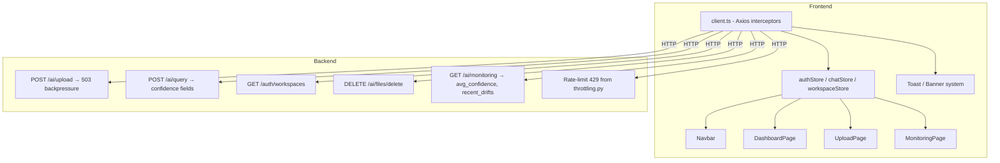
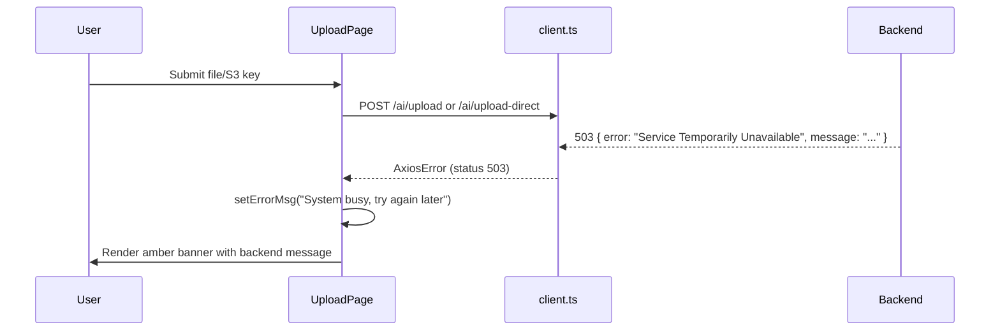
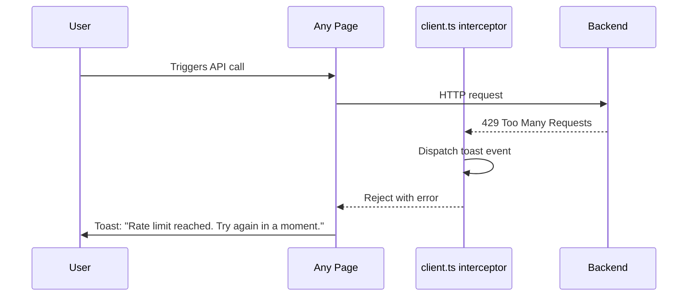
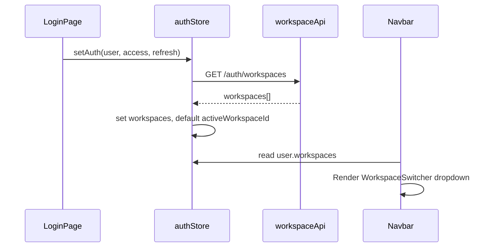
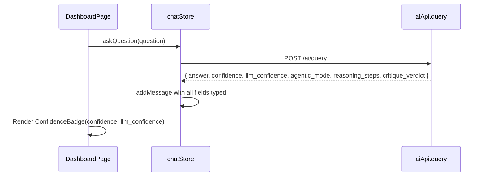

# Design Document: Frontend Improvements

## Overview

The Arishem frontend is a React 18 + TypeScript + Vite SPA backed by a Django REST API. The existing implementation covers auth, chat, file management, monitoring, and meetings, but several backend capabilities are not yet surfaced in the UI.

This document details eight targeted improvements derived from a cross-reference analysis of the backend source code against the current frontend implementation. The improvements fall into four themes: error-handling completeness (503 queue-full, 429 rate-limit), API type fidelity (`QueryResponse` missing fields), richer chat transparency (confidence badge, agentic mode indicators already in store but not fully typed), file deletion surfaced in UploadPage, workspace refresh after login, and monitoring page gaps (confidence trend chart, drift timeline).

The design uses TypeScript throughout, consistent with the existing codebase.

---

## Architecture



---

## Sequence Diagrams

### 503 Queue-Full Handling



### 429 Rate-Limit Handling (interceptor)



### Workspace Refresh on Login



### Confidence Badge in Chat



---

## Components and Interfaces

### Component: `ConfidenceBadge`

**Purpose**: Renders retrieval score (`confidence`) and LLM confidence (`llm_confidence`) for each assistant message.

**Interface**:
```typescript
interface ConfidenceBadgeProps {
  /** Retrieval score from Qdrant (0..1), may be undefined */
  confidence?: number;
  /** LLM self-assessed confidence (0..1), may be undefined */
  llm_confidence?: number;
}
```

**Responsibilities**:
- Show colour-coded badges (green ≥ 0.8, amber ≥ 0.5, red < 0.5)
- Render a low-confidence warning label when both values are below 0.5
- Accept `undefined` gracefully (render nothing)

---

### Component: `WorkspaceSwitcher` (inline in Navbar)

**Purpose**: Dropdown that lists all workspaces the user belongs to; switches `activeWorkspaceId` in `authStore`.

**Interface**:
```typescript
interface WorkspaceSwitcherProps {
  workspaces: Workspace[];
  activeWorkspaceId: number | null;
  onSwitch: (id: number) => void;
}
```

**Responsibilities**:
- Render only when `workspaces.length > 1`
- Calls `authStore.setActiveWorkspaceId` on selection
- Triggers `chatStore.fetchFiles()` when workspace changes

---

### Component: `DriftTimeline` (inside MonitoringPage)

**Purpose**: Visual timeline of recent drift events with score bar.

**Interface**:
```typescript
interface DriftTimelineProps {
  drifts: DriftEvent[];
}

interface DriftEvent {
  id: number;
  drift_score: number;
  timestamp: string;
}
```

**Responsibilities**:
- Render drift events ordered by timestamp descending
- Show a progress-bar-style score visualisation per event
- Handle empty state (no drifts)

---

### Component: `ConfidenceTrendChart` (inside MonitoringPage)

**Purpose**: Line chart of per-day average confidence over the last 7 days.

**Interface**:
```typescript
interface ConfidenceTrendChartProps {
  data: ConfidenceTrendPoint[];
}

interface ConfidenceTrendPoint {
  date: string;
  avg_confidence: number;
}
```

**Responsibilities**:
- Accept array of daily confidence aggregates
- Use Chart.js (already installed) for rendering
- Colour the line red when average drops below 0.35 (drift threshold)

---

### API module: `workspaceApi`

**Purpose**: New thin wrapper around `GET /auth/workspaces`.

**Interface**:
```typescript
// src/api/workspace.ts
export const workspaceApi = {
  listWorkspaces: async (): Promise<Workspace[]> => {
    const response = await apiClient.get<Workspace[]>('/auth/workspaces');
    return response.data;
  },
};
```

---

## Data Models

### `QueryResponse` (updated)

```typescript
export interface QueryResponse {
  answer: string;
  sources: string[];
  chunks: number;
  citations?: { source: string; snippet: string }[];
  unverified?: string;
  confidence?: number;         // retrieval score from Qdrant
  llm_confidence?: number;     // LLM self-assessed confidence
  agentic_mode: boolean;       // NEW: true when agentic pipeline ran
  reasoning_steps: ReasoningStep[];  // NEW: typed, not any[]
  critique_verdict: string;    // NEW: "PASS" | "PARTIAL" | "FAIL" | "SKIPPED"
}

export interface ReasoningStep {
  phase: 'decomposition' | 'retrieval' | 'synthesis' | 'self_critique' | 'retry_synthesis';
  is_complex?: boolean;
  sub_queries?: string[];
  total_unique_chunks?: number;
  llm_call?: number;
  verdict?: string;
  unsupported_claims?: string[];
}
```

**Validation Rules**:
- `agentic_mode` defaults to `false` when absent
- `reasoning_steps` defaults to `[]` when absent
- `critique_verdict` defaults to `"SKIPPED"` when absent

---

### `MonitoringStats` (updated)

```typescript
export interface MonitoringStats {
  total_predictions: number;
  error_count: number;
  avg_latency: number;
  avg_confidence: number;       // already present, needs prominent display
  chart_data: ChartDataPoint[]; // query volume per day
  recent_drifts: DriftEvent[];  // already present, needs timeline visualisation
  confidence_trend?: ConfidenceTrendPoint[]; // NEW: if backend provides it
}
```

---

### `AuthStore` (additions)

```typescript
interface AuthState {
  // existing fields ...
  workspaces: Workspace[];         // NEW: canonical list refreshed from /auth/workspaces
  refreshWorkspaces: () => Promise<void>; // NEW: calls workspaceApi.listWorkspaces()
}
```

---

## Algorithmic Pseudocode

### 503/429 Response Interceptor Extension

```pascal
ALGORITHM handleResponseError(error: AxiosError)
INPUT: error – rejected Axios response
OUTPUT: rejected Promise with enriched error or toast side-effect

BEGIN
  status ← error.response?.status

  IF status = 503 THEN
    // Bubble up as-is; UploadPage will surface the message
    RETURN Promise.reject(error)
  END IF

  IF status = 429 THEN
    // Emit a toast notification
    dispatchToastEvent({
      type: "warning",
      message: "Rate limit reached — please wait a moment before retrying."
    })
    RETURN Promise.reject(error)
  END IF

  IF status = 401 AND NOT isAuthRequest THEN
    // Existing refresh logic (unchanged)
    RETURN handleTokenRefresh(error)
  END IF

  RETURN Promise.reject(error)
END
```

**Preconditions:**
- `error.config` is defined
- `error.response` may be undefined (network error)

**Postconditions:**
- For 429: a toast event is dispatched exactly once per rejected request
- For 503: error propagates unchanged so callers can read `error.response.data.message`
- For 401: existing refresh logic is invoked

---

### Workspace Refresh After Login

```pascal
PROCEDURE refreshWorkspacesAfterAuth(user: User)
INPUT: user – freshly authenticated user object
OUTPUT: authStore.workspaces updated

BEGIN
  SEQUENCE
    existing ← user.workspaces  // from login/register response

    IF existing IS NOT EMPTY THEN
      setWorkspaces(existing)
      setActiveWorkspaceId(existing[0].id)
    END IF

    // Fetch fresh list independently (covers edge cases)
    TRY
      fresh ← await workspaceApi.listWorkspaces()
      setWorkspaces(fresh)
      IF activeWorkspaceId NOT IN fresh.map(w => w.id) THEN
        setActiveWorkspaceId(fresh[0].id)
      END IF
    CATCH error
      // Non-fatal: use workspaces from login response
      LOG "Workspace refresh failed:", error
    END TRY
  END SEQUENCE
END PROCEDURE
```

**Preconditions:**
- User is authenticated (valid access token in store)

**Postconditions:**
- `authStore.workspaces` contains the latest server-side list
- `authStore.activeWorkspaceId` is a valid id from the workspace list

---

### File Deletion in UploadPage

```pascal
PROCEDURE handleDeleteFile(s3Key: string)
INPUT: s3Key – object key of file to delete
OUTPUT: file removed from list, UI refreshed

BEGIN
  confirmed ← window.confirm(`Remove "${basename(s3Key)}" from knowledge base?`)

  IF NOT confirmed THEN
    RETURN
  END IF

  setDeletingKey(s3Key)

  TRY
    await aiApi.deleteFile(s3Key)
    await fetchFiles()          // refresh file list
    setSuccessToast("File removed successfully")
  CATCH error
    setErrorMsg(error.response?.data?.error OR "Delete failed")
  FINALLY
    setDeletingKey(null)
  END TRY
END PROCEDURE
```

---

## Key Functions with Formal Specifications

### `ConfidenceBadge` render function

```typescript
function ConfidenceBadge({ confidence, llm_confidence }: ConfidenceBadgeProps): JSX.Element | null
```

**Preconditions:**
- At least one of `confidence` or `llm_confidence` is defined and is a number in `[0, 1]`

**Postconditions:**
- Returns `null` when both props are `undefined`
- Returns a badge element with appropriate colour class when either prop is defined
- Never throws for any numeric input in `[0, 1]`

**Loop Invariants:** N/A

---

### `authStore.refreshWorkspaces`

```typescript
refreshWorkspaces: async () => void
```

**Preconditions:**
- `authStore.accessToken` is non-null (user is authenticated)

**Postconditions:**
- `authStore.workspaces` is updated with the latest workspace list
- `authStore.activeWorkspaceId` remains valid (not referencing a deleted workspace)
- On network failure: `authStore.workspaces` is unchanged

---

### `workspaceApi.listWorkspaces`

```typescript
listWorkspaces: async (): Promise<Workspace[]>
```

**Preconditions:**
- `apiClient` has a valid JWT access token attached via request interceptor

**Postconditions:**
- Returns a non-null array (empty when user has no workspaces)
- Throws `AxiosError` on non-2xx responses

---

## Example Usage

```typescript
// 1. 503 handling in UploadPage
try {
  await aiApi.uploadDirect(file, workspaceId);
} catch (err: any) {
  const code = err.response?.status;
  if (code === 503) {
    const msg = err.response?.data?.message || "System busy, try again later.";
    setErrorMsg(msg);
  }
}

// 2. Confidence badge in DashboardPage
{msg.role === 'assistant' && (
  <ConfidenceBadge
    confidence={msg.confidence}
    llm_confidence={msg.llm_confidence}
  />
)}

// 3. Workspace refresh after login
const handleLogin = async (email: string, password: string) => {
  const { user, tokens } = await authApi.login(email, password);
  authStore.setAuth(user, tokens.access, tokens.refresh);
  await authStore.refreshWorkspaces(); // fetch fresh list
};

// 4. QueryResponse type usage (fully typed)
const response: QueryResponse = await aiApi.query(question, workspaceId);
// response.agentic_mode is now boolean, not (response as any).agentic_mode
// response.reasoning_steps is now ReasoningStep[], not any[]
```

---

## Correctness Properties

*A property is a characteristic or behavior that should hold true across all valid executions of a system — essentially, a formal statement about what the system should do. Properties serve as the bridge between human-readable specifications and machine-verifiable correctness guarantees.*

### Property 1: 503 error message propagation

*For any* upload call that returns HTTP 503, the error message string from `error.response.data.message` SHALL be surfaced to the user in the UI (not swallowed or replaced with a generic fallback), and the upload form SHALL remain interactive.

**Validates: Requirements 1.1, 1.2**

### Property 2: 429 toast uniqueness

*For any* API request that receives HTTP 429, exactly one toast notification SHALL be dispatched — no duplicate toasts for a single rejected request.

**Validates: Requirements 6.1**

### Property 3: ConfidenceBadge null safety

*For any* assistant message where both `confidence` and `llm_confidence` are `undefined`, the `ConfidenceBadge` component SHALL render `null` without throwing.

**Validates: Requirements 4.1**

### Property 4: Confidence badge colour correctness

*For any* numeric confidence value in `[0, 1]`, the badge colour SHALL be green for ≥ 0.8, amber for ≥ 0.5, and red for < 0.5.

**Validates: Requirements 4.1, 4.2**

### Property 5: Workspace list consistency after refresh

*For any* authenticated session, after `refreshWorkspaces()` completes successfully, every workspace id in `authStore.workspaces` SHALL appear in the server response, and `activeWorkspaceId` SHALL be an id contained in the refreshed list.

**Validates: Requirements 8.1, 2.1**

### Property 6: QueryResponse type completeness

*For any* response from `POST /ai/query`, the `QueryResponse` TypeScript type SHALL accept the response without runtime cast to `any` — i.e., `agentic_mode`, `reasoning_steps`, and `critique_verdict` are all first-class typed fields.

**Validates: Requirements 3.1, 3.2**

### Property 7: File deletion visibility

*For any* file in the `IngestedFile[]` list rendered in the UploadPage file list, when the user has `editor` or `admin` role, a delete control SHALL be visible and actionable for that file.

**Validates: Requirements 5.1**

### Property 8: Monitoring confidence trend data integrity

*For any* monitoring stats response containing `avg_confidence`, the value SHALL be displayed as a percentage (multiplied by 100, rounded to one decimal place) in the KPI card, matching the value stored in `MonitoringStats.avg_confidence`.

**Validates: Requirements 7.1**

---

## Error Handling

### Error Scenario 1: 503 Service Unavailable (upload)

**Condition**: Backend queue depth ≥ 50; `_run_ingestion` returns HTTP 503 with `{ "error": "Service Temporarily Unavailable", "message": "..." }`
**Response**: `UploadPage` reads `err.response.data.message` and renders it in the amber error banner; the form stays enabled for retry.
**Recovery**: User can retry after queue drains; no data loss.

### Error Scenario 2: 429 Too Many Requests

**Condition**: User exceeds role-based throttle (viewer: 10/min, etc.)
**Response**: `client.ts` response interceptor catches status 429 and dispatches a global toast event. Individual pages do not need to handle 429 explicitly.
**Recovery**: Toast auto-dismisses after 5 seconds; user retries when quota resets.

### Error Scenario 3: Workspace refresh failure

**Condition**: `GET /auth/workspaces` returns an error after login (e.g., network glitch)
**Response**: `refreshWorkspaces()` catches the error silently and keeps the workspace list derived from the login response. No UX disruption.
**Recovery**: Workspace switcher still works using data from initial auth response.

### Error Scenario 4: File deletion failure

**Condition**: `DELETE /ai/files/delete` returns 403 (wrong workspace) or 404
**Response**: `handleDeleteFile` reads `err.response.data.error` and sets `errorMsg` state, rendering an inline error.
**Recovery**: File list is not re-fetched; current list remains intact.

---

## Testing Strategy

### Unit Testing Approach

Unit tests use Vitest (standard choice for Vite projects). Key test targets:
- `ConfidenceBadge` renders correct colour classes for boundary values (0, 0.49, 0.5, 0.79, 0.8, 1.0)
- `ConfidenceBadge` renders `null` when both props are `undefined`
- `authStore.refreshWorkspaces` updates workspace list and preserves valid `activeWorkspaceId`
- `QueryResponse` type accepts all backend fields without cast to `any`

### Property-Based Testing Approach

**Property Test Library**: fast-check

Property tests focus on:
- Confidence badge colour invariant across the full `[0, 1]` float range
- Workspace consistency invariant: after any refresh, `activeWorkspaceId` is always in the returned list
- `QueryResponse` deserialisation round-trip: any object matching the interface shape is accepted by the type

### Integration Testing Approach

- 503 / 429 responses: mock Axios adapter returns error codes; verify UI state in UploadPage and interceptor toast
- Workspace switcher: integration test verifying that switching workspace triggers `fetchFiles` with the new id
- Monitoring confidence trend: verify rendered `<canvas>` element appears when `avg_confidence` is in the response

---

## Performance Considerations

- `refreshWorkspaces` is called once post-login and on manual refresh; the `GET /auth/workspaces` response is lightweight (workspace id + name only).
- The confidence trend chart reuses Chart.js instances already registered in `MonitoringPage`, so no additional bundle cost.
- The toast system uses a simple event emitter pattern (no new state manager) to avoid re-rendering the entire component tree.

---

## Security Considerations

- File deletion requires `editor` or `admin` role — the delete button is conditionally rendered using `user.role` from the auth store, matching the backend `IsAdminOrEditor` permission class.
- No new authentication surfaces are introduced; `GET /auth/workspaces` uses the existing JWT interceptor.
- Toast messages sourced from backend error responses must be rendered as plain text (not `dangerouslySetInnerHTML`) to prevent XSS.

---

## Dependencies

All improvements use the existing dependency set:
- **React 18 / TypeScript** — component and type changes
- **Zustand** — authStore additions
- **Axios** — interceptor extension in `client.ts`
- **Chart.js + react-chartjs-2** — confidence trend chart (already installed)
- **Lucide React** — icons already in use
- **Tailwind CSS** — styling consistent with existing design system
- **fast-check** (new dev dependency) — property-based testing
- **Vitest + @testing-library/react** (new dev dependencies) — test runner
