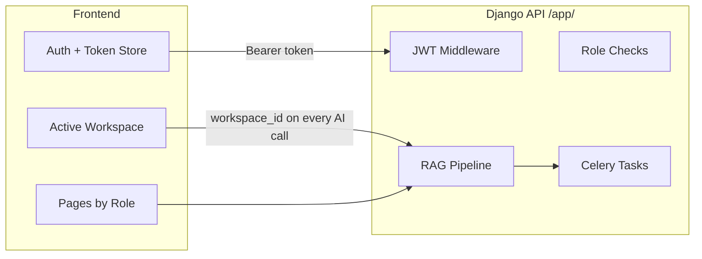
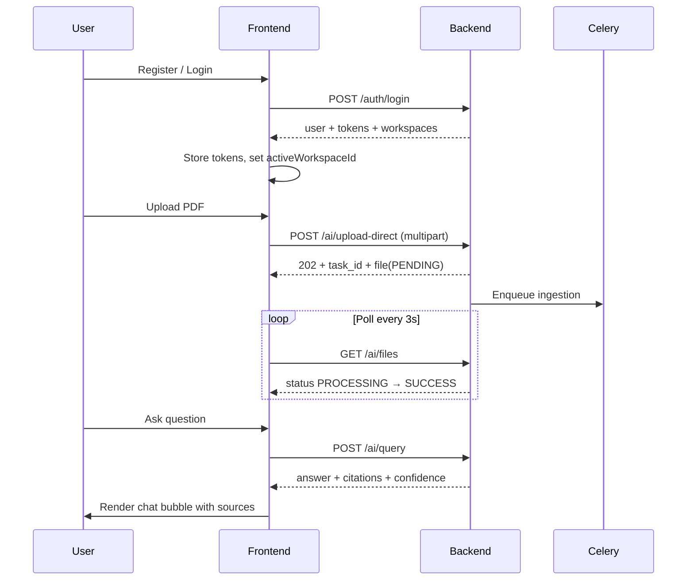

# Building a Frontend for the Arishem Backend

If you only have the backend, treat it as a **JWT-secured REST API** at:

```
http://localhost:8000/app/
```

The frontend’s job is to handle auth, workspace context, role-based UI, and the three async workflows: **upload → poll status → query**.

---

## 1. Mental Model

The backend does not render UI. It exposes JSON endpoints grouped into:

| Area | Purpose |
|------|---------|
| **Auth** | Register, login, token refresh, profile, OAuth |
| **Workspaces** | Multi-tenant isolation — almost every AI call needs a `workspace_id` |
| **RAG** | Upload, query, list/delete files |
| **Monitoring** | Metrics for editors/admins |
| **Meetings** | YouTube ingest + structured analysis |



---

## 2. Recommended Frontend Stack

Any SPA works. The existing Arishem frontend uses:

- **React 18 + TypeScript + Vite**
- **React Router** — routing + protected routes
- **Zustand** — auth state + chat state
- **Axios** — HTTP client with interceptors
- **Tailwind CSS** — styling

You could also use Next.js, Vue, Svelte, or a mobile app — as long as it can send `Authorization: Bearer <token>` and handle JSON.

---

## 3. API Client Setup

### Base URL

```env
VITE_API_URL=http://localhost:8000/app
```

### Every authenticated request

```http
Authorization: Bearer <access_token>
Content-Type: application/json
```

### Important backend quirks

1. **No trailing slashes** — use `/app/ai/query`, not `/app/ai/query/`
2. **CORS is open** — `CORS_ALLOW_ALL_ORIGINS = True` in settings, so a separate frontend origin is fine
3. **Token refresh** — access tokens expire in **1 hour**; refresh tokens in **7 days** and rotate on use

### Axios interceptor pattern (essential)

```typescript
// On every request: attach access token
config.headers.Authorization = `Bearer ${accessToken}`;

// On 401: call POST /auth/token/refresh with { refresh }
// Store new access + refresh, retry original request
// If refresh fails → clear auth → redirect to /login
```

This matches what the existing client does in `frontend/src/api/client.ts`.

---

## 4. Auth Flow

### Register

```http
POST /app/auth/register
{
  "email": "user@example.com",
  "password": "SecurePass123!",
  "password2": "SecurePass123!",
  "role": "viewer"        // optional: viewer | editor | admin
}
```

Response (201):

```json
{
  "message": "Account created successfully",
  "user": {
    "id": 1,
    "email": "user@example.com",
    "username": "user",
    "role": "viewer",
    "workspaces": [{ "id": 1, "name": "user's Workspace", "created_at": "..." }],
    "date_joined": "...",
    "is_active": true
  },
  "tokens": { "access": "...", "refresh": "..." }
}
```

Registration auto-creates a default workspace.

### Login

```http
POST /app/auth/login
{ "email": "...", "password": "..." }
```

Same shape as register, minus `message`.

### Token refresh

```http
POST /app/auth/token/refresh
{ "refresh": "<refresh_token>" }
```

Returns `{ "access": "...", "refresh": "..." }` — old refresh token is blacklisted.

### Profile

```http
GET /app/auth/me
```

### Optional: Social login

| Provider | Endpoint | Body |
|----------|----------|------|
| Google | `POST /app/auth/google` | `{ "token": "<google_id_token>" }` |
| GitHub | `POST /app/auth/github` | `{ "code": "<oauth_code>" }` |

### What to store client-side

| Key | Value |
|-----|-------|
| `accessToken` | JWT access token |
| `refreshToken` | JWT refresh token |
| `user` | Full user object including `role` and `workspaces` |
| `activeWorkspaceId` | Selected workspace ID |

On login/register, set `activeWorkspaceId` to `user.workspaces[0].id`.

---

## 5. Workspace Context (Critical)

Almost every AI endpoint accepts `workspace_id`. If omitted, the backend uses the user’s **first workspace**.

```typescript
// Always pass workspace_id explicitly
await api.post('/ai/query', {
  question: 'What is the leave policy?',
  workspace_id: activeWorkspaceId,
});
```

The frontend should expose a **workspace switcher** in the navbar when a user belongs to multiple workspaces.

---

## 6. Pages You Should Build

| Page | Route | Who can access | Backend endpoints |
|------|-------|----------------|-------------------|
| Login | `/login` | Public | `POST /auth/login`, OAuth |
| Register | `/register` | Public | `POST /auth/register` |
| Dashboard / Chat | `/` | All authenticated | `POST /ai/query`, `GET /ai/files` |
| Upload | `/upload` | Editor, Admin | `POST /ai/upload-direct` |
| Monitoring | `/monitoring` | Editor, Admin | `GET /ai/monitoring` |
| Meetings | `/meetings` | All authenticated | YouTube + analysis endpoints |
| Profile | `/profile` | All authenticated | `GET /auth/me` |

### Role-based route guard

```typescript
// viewer  → chat + files + meetings only
// editor  → + upload + monitoring
// admin   → same as editor (+ Django admin panel separately)
```

Backend enforces this too — the UI should hide actions the API would reject with **403**.

---

## 7. Feature-by-Feature Integration

### A. Chat / RAG Query (main screen)

```http
POST /app/ai/query
{
  "question": "What is the data retention period?",
  "workspace_id": 1,
  "top_k": 5          // optional
}
```

Response (200):

```json
{
  "answer": "The retention period is 90 days...",
  "sources": ["uploads/SOP-104.pdf"],
  "citations": [{ "source": "SOP-104.pdf", "snippet": "..." }],
  "unverified": "",
  "chunks": 5,
  "confidence": 0.72,
  "llm_confidence": 0.95,
  "agentic_mode": true,
  "reasoning_steps": [...],
  "critique_verdict": "PASS"
}
```

**UI behavior:**

- Show a chat thread (user message → assistant answer)
- Render **sources/citations** under each answer
- Show **confidence** — low confidence often means OOD rejection
- If `agentic_mode: true`, optionally expand `reasoning_steps` for transparency
- Show loading state — queries take **~1–3 seconds**
- Handle **429** (rate limit: viewer 10/min, editor 60/min, admin 100/min)

**Viewer caveat:** viewers only see documents they uploaded (backend filters by `uploaded_by` email).

---

### B. File Upload (async — important)

Upload is **not synchronous**. The API returns **202 Accepted** immediately.

```http
POST /app/ai/upload-direct
Content-Type: multipart/form-data

file=<binary>
workspace_id=1
```

Response (202):

```json
{
  "message": "Ingestion task queued successfully",
  "task_id": "abc-123-celery-id",
  "file": {
    "id": 42,
    "s3_key": "uploads/report.pdf",
    "file_type": "pdf",
    "status": "PENDING",
    "chunks_stored": 0
  }
}
```

**Frontend must poll two things:**

1. **File list** — `GET /app/ai/files?workspace_id=1`

```json
{
  "files": [{
    "id": 42,
    "s3_key": "uploads/report.pdf",
    "file_type": "pdf",
    "status": "PENDING | PROCESSING | SUCCESS | FAILED",
    "chunks_stored": 42,
    "error_message": null,
    "ingested_at": "...",
    "uploaded_by__email": "user@example.com"
  }],
  "total": 1
}
```

2. **Celery task** (optional) — `GET /app/ai/tasks/{task_id}`

```json
{
  "task_id": "abc-123",
  "status": "PENDING | STARTED | SUCCESS | FAILURE",
  "result": "...",
  "error": "..."
}
```

**Recommended upload UX:**

```
User picks file
  → POST upload-direct
  → Show "Processing..." badge
  → Poll GET /ai/files every 3–5s
  → When status === SUCCESS → show chunk count, enable querying
  → When status === FAILED → show error_message
  → On 503 → "System busy, try again later" (queue full)
  → On 409 → "File already ingested"
```

Alternative upload path if files are already in S3:

```http
POST /app/ai/upload
{ "s3_key": "documents/report.pdf", "workspace_id": 1 }
```

---

### C. File Management

```http
GET  /app/ai/files?workspace_id=1     // list
DELETE /app/ai/files/delete
       { "s3_key": "uploads/report.pdf" }
```

Delete only removes the DB record — vectors may remain orphaned in Qdrant. The UI should treat delete as “remove from knowledge base tracking.”

---

### D. Monitoring Dashboard

```http
GET /app/ai/monitoring?workspace_id=1
```

Response:

```json
{
  "total_predictions": 152,
  "error_count": 3,
  "avg_latency": 2450.35,
  "avg_confidence": 0.5234,
  "chart_data": [{ "date": "2026-08-12", "count": 30 }],
  "recent_drifts": [{ "id": 1, "drift_score": 0.31, "timestamp": "..." }]
}
```

Build cards + a 7-day bar chart (Chart.js/Recharts). Editors and admins only.

---

### E. Meeting Intelligence

**Ingest YouTube** (editor/admin, synchronous — can take minutes):

```http
POST /app/ai/meetings/ingest-youtube
{ "url": "https://youtube.com/watch?v=...", "workspace_id": 1 }
```

Response (201):

```json
{
  "message": "YouTube meeting successfully ingested and analysis queued.",
  "file_id": 55,
  "chunks_stored": 12
}
```

**Fetch analysis** (poll until ready):

```http
GET /app/ai/meetings/55/analysis
```

Response (200):

```json
{
  "file_id": 55,
  "title": "Q3 Planning Sync",
  "summary": "...",
  "action_items": ["Follow up with legal", "..."],
  "key_decisions": ["Approved budget increase"],
  "open_questions": ["Timeline for rollout?"],
  "full_transcript": "...",
  "created_at": "..."
}
```

404 means analysis is still processing — poll every few seconds.

Meeting chat reuses the same `POST /ai/query` against meeting documents in the workspace.

---

## 8. Suggested Frontend Architecture

```
src/
├── api/
│   ├── client.ts       # Axios + JWT interceptors
│   ├── auth.ts         # login, register, refresh, me
│   └── ai.ts           # upload, query, files, monitoring, meetings
├── store/
│   ├── authStore.ts    # user, tokens, activeWorkspaceId
│   └── chatStore.ts    # messages, files, query state
├── components/
│   ├── layout/Navbar.tsx
│   ├── layout/ProtectedRoute.tsx
│   └── chat/MessageBubble.tsx
└── pages/
    ├── LoginPage.tsx
    ├── DashboardPage.tsx    # chat + file sidebar
    ├── UploadPage.tsx
    ├── MonitoringPage.tsx
    └── MeetingsPage.tsx
```

### State responsibilities

| Store | Holds |
|-------|-------|
| **authStore** | User, tokens, active workspace, login/logout |
| **chatStore** | Chat messages, file list, loading flags, askQuestion() |

---

## 9. Error Handling Checklist

| Status | Meaning | Frontend action |
|--------|---------|-----------------|
| **401** | Token expired/invalid | Refresh token or redirect to login |
| **403** | Wrong role or workspace | Show “Access denied” or hide UI |
| **409** | Duplicate file | “Already ingested” |
| **415** | Unsupported file type | Show supported extensions |
| **429** | Rate limited | “Too many requests, wait a minute” |
| **502** | RAG/S3 failure | “Service error, try again” |
| **503** | Ingestion queue full | “System busy, retry later” |

Backend error bodies usually look like:

```json
{ "error": "Human-readable message" }
```

---

## 10. End-to-End User Journey



---

## 11. Minimal Build Order

If starting from scratch, build in this order:

1. **API client + auth** — login, register, token refresh
2. **Protected routes + role guard**
3. **Workspace selector** in navbar
4. **Dashboard chat** — query + render answer/citations
5. **File list sidebar** — poll ingestion status
6. **Upload page** — multipart upload + status tracking
7. **Monitoring page** — charts for editors/admins
8. **Meetings page** — YouTube ingest + analysis polling
9. **OAuth** — optional polish

---

## 12. What the Backend Expects You to Handle

The backend will **not**:

- Serve HTML or static frontend assets (unless you add that separately)
- Push WebSocket updates for ingestion progress — you must **poll**
- Remember UI state — you manage chat history client-side (or add your own persistence)
- Validate file types in the UI — but you should mirror supported extensions: `.pdf`, `.docx`, `.pptx`, `.mp4`, `.mp3`, etc.

The backend **will**:

- Enforce JWT on all `/app/ai/*` routes
- Enforce RBAC (viewer cannot upload)
- Scope all data by workspace
- Return structured JSON you can bind directly to UI components

---

## Summary

A frontend for Arishem is a **JWT-authenticated SPA** that:

1. Logs in and stores tokens + active workspace
2. Sends `workspace_id` on every AI call
3. Uses **multipart upload + polling** for ingestion (202, not 201)
4. Renders chat with citations and confidence
5. Hides upload/monitoring for viewers
6. Polls meeting analysis until `GET /meetings/{id}/analysis` returns 200

The existing `frontend/` folder in the repo is essentially the reference implementation of this contract — you can copy its API layer and page structure, or rebuild the UI in any framework as long as you follow the same API patterns.

If you want, I can next sketch a **minimal React starter** (just auth + chat + upload) or a **Postman/OpenAPI-style API spec** you can hand to any frontend team.